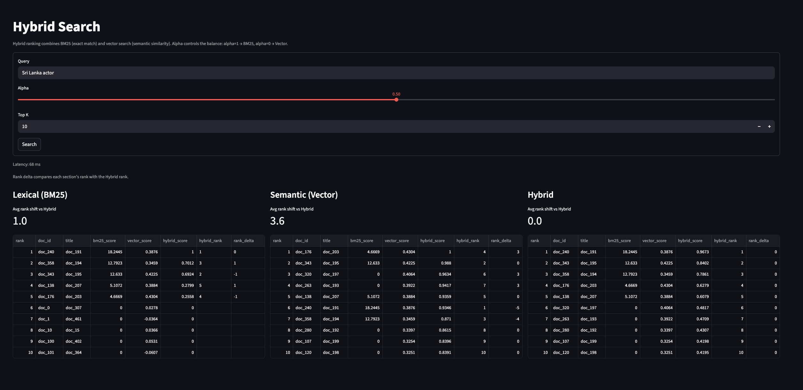

# Hybrid Search Engine (RAG)

## Summary

This project implements a **hybrid search system** that combines:

- **BM25 (lexical retrieval)** for exact keyword matching  
- **Vector search (semantic retrieval)** using embeddings  

The system improves retrieval quality by combining both signals through **score normalization and weighted fusion**.

---

## Overview

Traditional retrieval systems rely either on:
- keyword matching (BM25), or  
- semantic similarity (vector search)

Each has limitations:
- BM25 struggles with paraphrases  
- Vector search may miss exact matches  

This system addresses both by combining them into a **hybrid retrieval pipeline**.

---

## Architecture

### Retreival Flow

1. Query is sent to both BM25 and vector index  
2. Each returns top-k results  
3. Scores are **normalized independently (min-max)**  
4. Final score is computed:
    hybrid_score = α * bm25_norm + (1 - α) * vector_norm
5. Results are ranked by hybrid score  

---

## Components

### 1. Ingestion Pipeline
- Loads raw documents  
- Cleans and structures data into JSONL format  

---

### 2. BM25 Index
- Tokenizes documents  
- Computes term frequency and inverse document frequency  
- Supports keyword-based retrieval  

---

### 3. Vector Index
- Uses **Sentence Transformers** for embeddings  
- Stores vectors in **FAISS index**  
- Supports semantic similarity search  

---

### 4. Hybrid Search Service
- Merges BM25 and vector results by `doc_id`  
- Applies min-max normalization  
- Computes hybrid score using weighted combination  

---

### 5. Backend (FastAPI)
- Exposes `/search` endpoint  
- Accepts:
  - `query`
  - `top_k`
  - `alpha` (weight parameter)

---

### 6. Request Logging
- Every `/search` request gets a unique `request_id` (UUID)  
- Request telemetry is captured for both success and failure paths  
- Structured request logs are emitted as single-line JSON via the `hybrid_search` logger  
- Log metadata includes UTC timestamp, request parameters, latency, result count, and error (if any)  
- Request logs are persisted to SQLite at `data/query_logs.db` in the `query_logs` table  

---

### 7. Frontend (Streamlit)
- Query input  
- Alpha slider  
- Side-by-side comparison:
  - BM25
  - Vector
  - Hybrid  
- Rank comparison (rank delta)  
- Latency display
### Dashboard Preview




---

### 8. Evaluation Module
- Uses labeled queries (qrels)  
- Computes:
  - **MRR** (Mean Reciprocal Rank)
  - **nDCG@k** (Normalized Discounted Cumulative Gain)

---

## Evaluation Results

| System  | MRR   | nDCG@10 |
|--------|------|--------|
| BM25   | 0.9306 | 0.8282 |
| Vector | 0.9389 | 0.8420 |
| Hybrid | **0.9778** | **0.8864** |

### Observations

- **BM25** performs well on keyword-aligned queries  
- **Vector search** improves semantic understanding  
- **Hybrid search** consistently outperforms both  

### Key Insight

Hybrid search improves:
- **MRR** → better top result ranking  
- **nDCG** → better overall ranking  

---

## Running the Project

### 1. Setup Environment

```bash
python3.11 -m venv .venv
source .venv/bin/activate
pip install -e .
```

### 2. Prepare Dataset
Place raw data in: data/raw/
Run Ingestion

```bash
python -m hybrid_search.ingest.pipeline \
  --input data/raw \
  --out data/processed/docs.jsonl
  ```
### 3. Run Backend

```bash
uvicorn backend.app.api.main:app --reload
  ```
  Access:

http://localhost:8000
http://localhost:8000/docs

### 4. Run Frontend

```bash
streamlit run frontend/app.py
  ```
  Access:

http://localhost:8501

### 5. Example API Request

```bash
curl -X POST http://localhost:8000/search \
  -H "Content-Type: application/json" \
  -d '{
    "query": "Sri Lankan actress",
    "top_k": 5,
    "alpha": 0.5
  }'
  ```
### 6. Run Evaluation

```bash
python -m evaluation.run_eval
```
  ### 7. One-Command Run ( End to End)

```bash
./up.sh
```

This script bootstraps and runs the full local stack in one command:
- Creates `.venv` if missing, activates it, upgrades `pip`, and installs the project (`pip install -e .`)
- Starts FastAPI on `http://localhost:8000` and Streamlit on `http://localhost:8501`
- Writes service logs to:
  - `logs/api.log`
  - `logs/frontend.log`
- Keeps running while both services are healthy and exits if either process crashes
